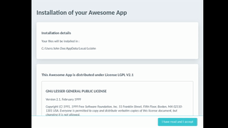

# Go Installer

This package provides a go cross-platform GUI installer to fulfill following use case :
1. User reads install conditions.
2. User accepts install conditions.
3. Installation proceeds and displays progress status on each step.
4. Display install global success/failure.



## Usage

Create an installer by providing a headline title :
````
i := installer.New("Installation of your app!")
````
Add one or many conditions to be accepted by the user :
````
i.AddCondition("Condition1", "Accept this before pursuing installation")
````
Add one or many installation steps to be executed once the user click on **Accept**.
````
i.AddStep(func() error { return nil }, "This step is installing...")
````
Start the GUI window by providing a window title
````
i.OpenWindow("Window Title")
````
## Doc

Some convenient steps are provided so you don't have to implement them manually. They all start with AddStep :
````
i.AddStepRmkDir(...)
i.AddStepCopyFiles(...)
````
A step is built from a function to process and a description to display to the user. Included steps comes with their intl description.

Because many of process functions are instant, there is a minimal delay of 2 sec for each of them to complete in order to give user a progress feedback.

You can add a custom step by providing a function that returns an error :
````
i.AddStep(func() error{return nil}, "A custom step description")
````
## Dependencies

The GUI is managed with wails : https://wails.app/

## Build

When you build for windows from linux, you need cross compilation libraries available with package build essentials :
````
apt-get install build-essential
````
A typical build command for windows would then be :
````
GOOS=windows CGO_ENABLED=1 CC=x86_64-w64-mingw32-gcc go build -ldflags="-H=windowsgui"
````
To add an icon to a .exe, an outstanding package is available : https://github.com/tc-hib/go-winres